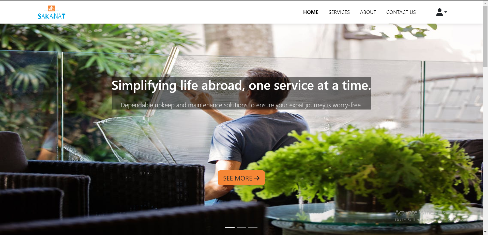
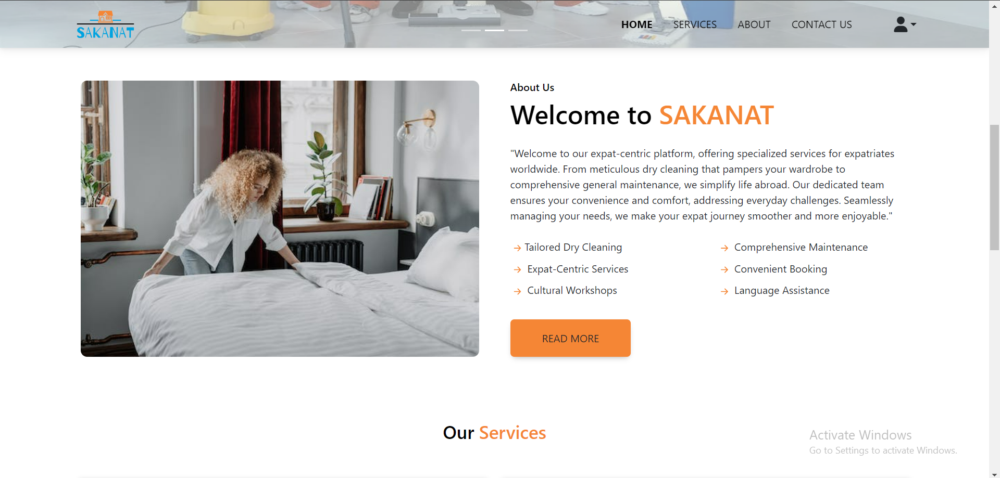
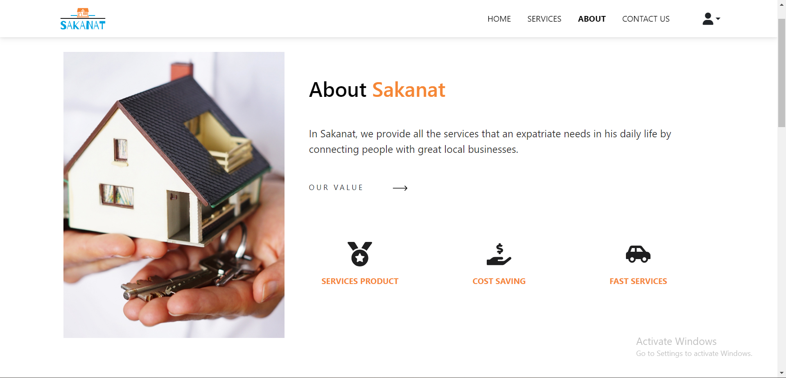

# SAKANAT

Welcome to our comprehensive website tailored to meet the needs of expatriates! We understand the unique challenges of living abroad, which is why we offer a range of specialized services to make your life easier. From convenient dry cleaning services that ensure your wardrobe stays impeccable, to general maintenance solutions that keep your living spaces in top-notch condition, we've got you covered. Our platform is designed to provide a seamless experience, allowing you to effortlessly schedule and manage these essential tasks. With a deep understanding of the expatriate lifestyle, we're committed to enhancing your quality of life by taking care of the little things, so you can focus on making the most of your international adventure.

Discover a tailored expatriate service website, offering hassle-free solutions like dry cleaning and general maintenance. Simplify your life abroad with our seamless platform designed to cater to your unique needs. Experience convenience and comfort as you navigate your expatriate journey.

## Tools Used in This Project

 React
 
 
 Figma
 
 
 BootStrap
 
 
 Node.js
 
 
 MongoDb